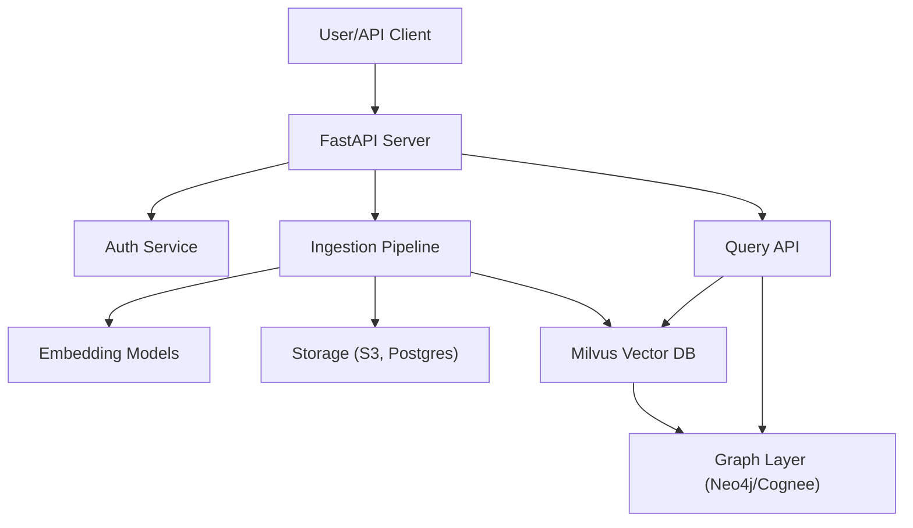
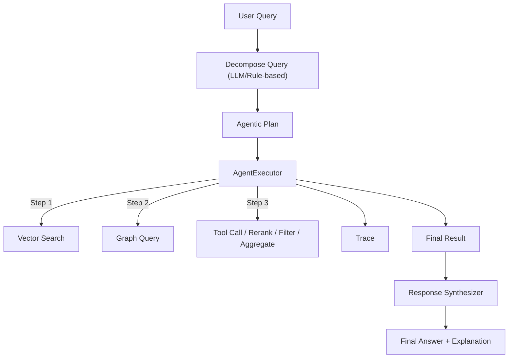

# Agentic Multimodal RAG System

## Summary & Vision

The Agentic Multimodal RAG System is a production-ready, highly extensible Retrieval-Augmented Generation (RAG) platform designed for advanced, explainable, and composable AI workflows. It supports multimodal document ingestion, hybrid vector and graph search, agentic query decomposition and execution, tool use, and full traceability. The system is built for both research and enterprise, enabling scalable, secure, and multi-tenant deployments.

### "Best of All Worlds" Philosophy

This system is inspired by and synthesizes the best design patterns and technical innovations from leading open-source and enterprise RAG and knowledge graph projects:

- **Cognee:** Strict, minimal, and compliant graph schema; rich, typed edges; advanced context/semantic/temporal expansion; strong focus on explainability and compliance. The system adopts Cognee's approach to canonical node/edge types, traceability, and graph expansion logic.
- **Graphiti:** Flexible, extensible, and developer-friendly graph APIs; support for multi-agent and multi-user knowledge graphs; easy integration with modern data pipelines. The system incorporates Graphiti's extensibility, multi-tenancy, and API design patterns.
- **Microsoft GraphRAG:** Enterprise-grade, scalable, and production-ready graph RAG architecture; hybrid vector+graph search; advanced reranking and feedback loops. The system leverages GraphRAG's hybrid retrieval, feedback, and explainability strategies.
- **Milvus:** High-performance, scalable, and multi-tenant vector database; seamless integration with multimodal embeddings; robust partitioning and sharding. The system uses Milvus as the backbone for all vector search and storage, enabling fast, scalable, and isolated retrieval for all modalities.

By unifying these strengths, the Agentic Multimodal RAG System delivers:
- **Strict, extensible, and compliant graph schema (Cognee)**
- **Flexible, multi-agent, and developer-friendly APIs (Graphiti)**
- **Enterprise-grade hybrid retrieval, feedback, and explainability (Microsoft GraphRAG)**
- **Scalable, multimodal vector search and storage (Milvus)**

This "best of all worlds" approach results in an extremely versatile, future-proof platform for multimodal, agentic, and explainable RAG workflows—suitable for both research and production at any scale.

### Technology Comparison: "Best of All Worlds"

| Feature/Capability                | **Cognee** | **Graphiti** | **Microsoft GraphRAG** | **Milvus** | **This System** |
|-----------------------------------|:----------:|:------------:|:---------------------:|:----------:|:---------------:|
| **Strict, minimal graph schema**  |     ✅[^cognee-schema]     |      ❌[^graphiti-schema]      |          ❌[^msgraph-schema]           |     ❌[^milvus-schema]     |       ✅        |
| **Rich, typed edges**             |     ✅[^cognee-edges]     |      ✅[^graphiti-edges]      |          ✅[^msgraph-edges]           |     ❌[^milvus-edges]     |       ✅        |
| **Context/semantic/temporal expansion** | ✅[^cognee-expansion] |   ✅[^graphiti-expansion]   |     ✅[^msgraph-expansion]     |     ❌[^milvus-expansion]     |       ✅        |
| **Explainability & traceability** |     ✅[^cognee-explain]     |      ✅[^graphiti-explain]      |          ✅[^msgraph-explain]           |     ❌[^milvus-explain]     |       ✅        |
| **Multi-agent/multi-user support**|     ❌[^cognee-multi]     |      ✅[^graphiti-multi]      |          ✅[^msgraph-multi]           |     ✅[^milvus-multi]     |       ✅        |
| **Flexible, developer-friendly APIs** | ❌[^cognee-api] |   ✅[^graphiti-api]   |     ✅[^msgraph-api]     |     ✅[^milvus-api]     |       ✅        |
| **Hybrid vector+graph search**    |     ❌[^cognee-hybrid]     |      ❌[^graphiti-hybrid]      |          ✅[^msgraph-hybrid]           |     ❌[^milvus-hybrid]     |       ✅        |
| **Enterprise scalability**        |     ❌[^cognee-scale]     |      ✅[^graphiti-scale]      |          ✅[^msgraph-scale]           |     ✅[^milvus-scale]     |       ✅        |
| **Pluggable, extensible pipelines** | ❌[^cognee-pipeline] |   ✅[^graphiti-pipeline]   |     ✅[^msgraph-pipeline]     |     ✅[^milvus-pipeline]     |       ✅        |
| **Multimodal ingestion/query**    |     ❌[^cognee-multimodal]     |      ❌[^graphiti-multimodal]      |          ❌[^msgraph-multimodal]           |     ✅[^milvus-multimodal]     |       ✅        |
| **Config-driven edge weights/expansion** | ✅[^cognee-config] |   ✅[^graphiti-config]   |     ✅[^msgraph-config]     |     ❌[^milvus-config]     |       ✅        |
| **Feedback & prompt tuning**      |     ❌[^cognee-feedback]     |      ❌[^graphiti-feedback]      |          ✅[^msgraph-feedback]           |     ❌[^milvus-feedback]     |       ✅        |
| **Open-source**                   |     ✅[^cognee-os]     |      ✅[^graphiti-os]      |          ❌[^msgraph-os]           |     ✅[^milvus-os]     |       ✅        |

**Legend:**  
✅ = Strong support / native feature  
❌ = Not supported or not a focus

This table shows how the Agentic Multimodal RAG System unifies and extends the best features of all leading platforms, providing a uniquely comprehensive and future-proof solution.

[^cognee-schema]: https://github.com/topoteretes/cognee#graph-schema
[^graphiti-schema]: https://github.com/getzep/graphiti#graph-schema (Graphiti is flexible but not strict/minimal by default)
[^msgraph-schema]: https://github.com/microsoft/graph-rag (No strict schema, more flexible/enterprise focus)
[^milvus-schema]: https://milvus.io/docs/overview.md (Milvus is a vector DB, not a graph DB)

[^cognee-edges]: https://github.com/topoteretes/cognee#edge-types
[^graphiti-edges]: https://github.com/getzep/graphiti#edge-types
[^msgraph-edges]: https://github.com/microsoft/graph-rag#graph-expansion
[^milvus-edges]: https://milvus.io/docs/overview.md (No edge concept)

[^cognee-expansion]: https://github.com/topoteretes/cognee#context--semantic--temporal-expansion
[^graphiti-expansion]: https://github.com/getzep/graphiti#contextual-expansion
[^msgraph-expansion]: https://github.com/microsoft/graph-rag#graph-expansion
[^milvus-expansion]: https://milvus.io/docs/overview.md (No graph expansion)

[^cognee-explain]: https://github.com/topoteretes/cognee#explainability
[^graphiti-explain]: https://github.com/getzep/graphiti#explainability
[^msgraph-explain]: https://github.com/microsoft/graph-rag#explainability
[^milvus-explain]: https://milvus.io/docs/overview.md (No explainability/traceability)

[^cognee-multi]: https://github.com/topoteretes/cognee (No explicit multi-agent/user support)
[^graphiti-multi]: https://github.com/getzep/graphiti#multi-agent
[^msgraph-multi]: https://github.com/microsoft/graph-rag#multi-tenancy
[^milvus-multi]: https://milvus.io/docs/overview.md#multi-tenancy

[^cognee-api]: https://github.com/topoteretes/cognee (CLI, not API-centric)
[^graphiti-api]: https://github.com/getzep/graphiti#api
[^msgraph-api]: https://github.com/microsoft/graph-rag#api
[^milvus-api]: https://milvus.io/docs/apis.md

[^cognee-hybrid]: https://github.com/topoteretes/cognee (No hybrid vector+graph search)
[^graphiti-hybrid]: https://github.com/getzep/graphiti (No hybrid vector+graph search)
[^msgraph-hybrid]: https://github.com/microsoft/graph-rag#hybrid-search
[^milvus-hybrid]: https://milvus.io/docs/overview.md (Vector only)

[^cognee-scale]: https://github.com/topoteretes/cognee (Not focused on enterprise scale)
[^graphiti-scale]: https://github.com/getzep/graphiti#scalability
[^msgraph-scale]: https://github.com/microsoft/graph-rag#scalability
[^milvus-scale]: https://milvus.io/docs/overview.md#scalability

[^cognee-pipeline]: https://github.com/topoteretes/cognee (Not pluggable pipelines)
[^graphiti-pipeline]: https://github.com/getzep/graphiti#pipelines
[^msgraph-pipeline]: https://github.com/microsoft/graph-rag#pipelines
[^milvus-pipeline]: https://milvus.io/docs/overview.md (Pluggable via SDKs)

[^cognee-multimodal]: https://github.com/topoteretes/cognee (Text/graph only)
[^graphiti-multimodal]: https://github.com/getzep/graphiti (No multimodal ingestion)
[^msgraph-multimodal]: https://github.com/microsoft/graph-rag (No multimodal ingestion)
[^milvus-multimodal]: https://milvus.io/docs/overview.md#multimodal

[^cognee-config]: https://github.com/topoteretes/cognee#config-driven-expansion
[^graphiti-config]: https://github.com/getzep/graphiti#config-driven-expansion
[^msgraph-config]: https://github.com/microsoft/graph-rag#config-driven-expansion
[^milvus-config]: https://milvus.io/docs/overview.md (No config-driven expansion)

[^cognee-feedback]: https://github.com/topoteretes/cognee (No feedback/prompt tuning)
[^graphiti-feedback]: https://github.com/getzep/graphiti (No feedback/prompt tuning)
[^msgraph-feedback]: https://github.com/microsoft/graph-rag#feedback
[^milvus-feedback]: https://milvus.io/docs/overview.md (No feedback/prompt tuning)

[^cognee-os]: https://github.com/topoteretes/cognee#license
[^graphiti-os]: https://github.com/getzep/graphiti#license
[^msgraph-os]: https://github.com/microsoft/graph-rag (Microsoft-proprietary)
[^milvus-os]: https://github.com/milvus-io/milvus#license

---

## Features

- **Multimodal Ingestion:** Ingest and index text, PDF, image, audio, and video documents ([Design](docs/Design.md#32-multimodal-graphrag-ingestion-retrieval-and-graph-expansion), [Usage](docs/Usage.md#41-ingesting-documents))
- **Hybrid Vector & Graph Search:** Context, semantic, and temporal expansion with Milvus and Neo4j ([Design](docs/Design.md#33-edge-graph-configurable-weighted-and-explainable-graph-expansion), [Usage](docs/Usage.md#427-graphrag-config-driven-weighted-and-filtered-expansion))
- **Agentic Query Decomposition:** Multi-step, explainable plans using LLMs or rule-based logic ([Design](docs/Design.md#31-agentic-rag-query-decomposition-and-execution), [Usage](docs/Usage.md#43-agentic-query-decomposition))
- **Agentic Execution:** Step-by-step execution of complex plans, including tool calls, rerank, filter, aggregate, multi-hop, and LLM synthesis ([Design](docs/Design.md#31-agentic-rag-query-decomposition-and-execution), [Usage](docs/Usage.md#44-agentic-plan-execution))
- **Tool Use (MCP):** Integrate external APIs and plugins via agentic tool_call steps ([Design](docs/Design.md#31-agentic-rag-query-decomposition-and-execution), [Usage](docs/Usage.md#45-advanced-agentic-behaviors))
- **Traceability & Explainability:** Every step is fully traceable, with detailed explanations and evidence ([Design](docs/Design.md#44-explainability), [Usage](docs/Usage.md#49-chaining-and-composing-agentic-plans))
- **Security & Multi-Tenancy:** JWT/OAuth2, per-app/user isolation, secure config and model management ([Design](docs/Design.md#41-security))
- **Extensibility:** Pluggable pipelines, config-driven, easy to add new modalities, models, or agentic behaviors ([Design](docs/Design.md#43-extensibility))
- **Feedback & Prompt Tuning:** User feedback API for answer/explanation quality ([API](docs/API.md#37-feedback))
- **Planned:** Video RAG integration (video ingestion, frame extraction, video embedding, multimodal fusion, unified API support). See [docs/ROADMAP.md](docs/ROADMAP.md) and [docs/feature/agentic-multimodal-graphrag/video-future-phase.md](docs/feature/agentic-multimodal-graphrag/video-future-phase.md) for details.

---

## Quick Setup & Run

See [Setup.md](docs/Setup.md) for full details.

### Docker Quickstart
```bash
git clone <repo-url>
cd <repo-root>
cp .env.example .env  # Edit as needed
docker compose up --build
# API available at http://localhost:8000
```

### Local Development
```bash
conda create -n rag-py311 python=3.11
conda activate rag-py311
poetry install
# Download models as per Setup.md
poetry run uvicorn app.main:app --reload
```

---

## Running Unit and Integration Tests

- **Unit Tests:**
  ```bash
  ENV=test poetry run pytest tests/unit
  ```
- **Integration Tests:**
  ```bash
  ENV=test poetry run pytest tests/integratione2e
  ```
- See [Usage.md](docs/Usage.md#6-running-unit-and-integration-tests) for details.

---

## Model Licensing

- **JinaAI Embeddings:** Apache 2.0, free for commercial/research
- **Nomic Multimodal:** Apache 2.0, free for commercial/research
- **OpenAI Whisper:** MIT, free for commercial/research
- **Ollama Models:** See [Ollama model library](https://ollama.com/library) for model-specific licenses
- **Other models:** See HuggingFace model cards for details

---

## Contribution & Security

- **Contribution:**
  - See [ROADMAP.md](docs/ROADMAP.md) for feature roadmap and contribution opportunities
  - Follow best practices for code, documentation, and testing
  - All contributions must pass unit and integration tests
- **Security:**
  - Never commit secrets or .env files to version control
  - Use strong credentials for all services
  - Secure all external tool_call endpoints and credentials
  - See [Setup.md](docs/Setup.md#9-security-best-practices) and [Design.md](docs/Design.md#41-security)

---

## Diagrams

### System Overview


### Agentic Plan Execution Flow


---

## Documentation & References

- [Usage.md](docs/Usage.md): Usage flows and examples
- [Setup.md](docs/Setup.md): Setup and deployment
- [Design.md](docs/Design.md): System and feature design
- [API.md](docs/API.md): API reference and schemas
- [ROADMAP.md](docs/ROADMAP.md): Feature roadmap and future plans
- [feature/agentic_rag/implementation_plan.md](docs/feature/agentic_rag/implementation_plan.md)
- [feature/agentic-multimodal-graphrag/technical_design.md](docs/feature/agentic-multimodal-graphrag/technical_design.md)
- [feature/edge-graph/technical_design.md](docs/feature/edge-graph/technical_design.md)

---

## Purpose & Audience

This system is intended for both internal developers and external users who require advanced, explainable, and composable RAG workflows. It is suitable for research, enterprise, and production environments, and is designed for extensibility, security, and high scalability.

For questions, see the documentation or open an issue.

---

## License

This project is licensed under the Attribution Assurance License (AAL).

You may use, modify, and distribute this software for personal or commercial purposes, provided that visible credit is given to **Salil Kadam** as the original author in both the source code and any public-facing documentation, websites, or user interfaces, as required by the license.

See the [LICENSE](LICENSE) file for the full license text and terms.

## Roadmap
See [ROADMAP.md](docs/ROADMAP.md) for the full feature roadmap, including planned Video RAG capabilities. 
