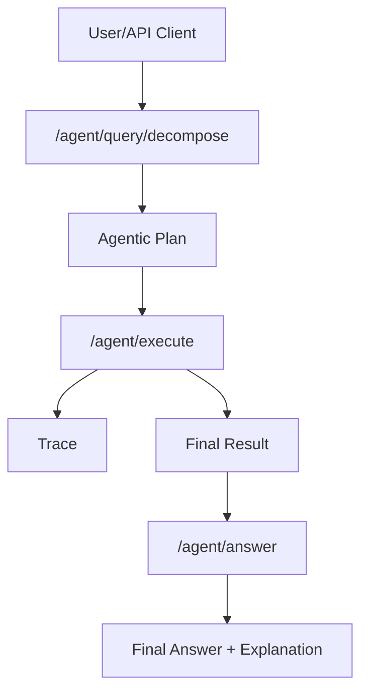

# API Reference: Agentic Multimodal RAG System

## 1. Overview

This document provides a comprehensive reference for all API endpoints in the Agentic Multimodal RAG System. It covers ingestion, vector and graph search, agentic decomposition and execution, response synthesis, feedback, health checks, and more. Each endpoint includes request/response schemas, example requests, error handling, security notes, and cross-references to Usage.md, Design.md, and Setup.md.

---

## 2. API Endpoints by Feature

### 2.1 Ingestion
- **POST /docs/ingest**
  - **Purpose:** Ingest a document (text, PDF, image, audio, video) for indexing and retrieval.
  - **Request:** `multipart/form-data` with file, app_id, user_id, (optional) metadata
  - **Response:** JSON with doc_id, status, message
  - **Example:**
    ```bash
    curl -X POST /docs/ingest -F "file=@mydoc.pdf" -F "app_id=myapp" -F "user_id=user1"
    ```
  - **See Also:** [Usage.md#Ingesting-Documents](Usage.md#41-ingesting-documents)

### 2.2 Vector Search (Multimodal)
- **POST /query/vector**
  - **Purpose:** Query the system with text or file (image, audio, PDF, video) for vector search.
  - **Request:**
    - `application/json` (text query): `{ "query": "...", "app_id": "...", "user_id": "...", "filters": {...} }`
    - `multipart/form-data` (file query): file, app_id, user_id, (optional) filters
  - **Response:** JSON with results (doc_id, score, content, metadata)
  - **Example:**
    ```bash
    curl -X POST /query/vector -H "Content-Type: application/json" -d '{"query": "What is GraphRAG?", "app_id": "myapp", "user_id": "user1"}'
    ```
  - **See Also:** [Usage.md#Querying-the-System](Usage.md#42-querying-the-system)

### 2.3 GraphRAG Query (Graph Expansion)
- **POST /query/graph**
  - **Purpose:** Query with text or file and expand results using graph context (semantic, temporal, context edges).
  - **Request:**
    - `application/json` or `multipart/form-data` (see Usage.md)
    - Parameters: query/file, app_id, user_id, graph_expansion (depth, type, weights, etc.), filters (edge_types, min_weight, metadata)
  - **Response:** JSON with results (doc_id, score, content, metadata, graph_context), explainability fields
  - **Example:**
    ```bash
    curl -X POST /query/graph -H "Content-Type: application/json" -d '{"query": "What happened last week?", "app_id": "myapp", "user_id": "user1", "graph_expansion": {"depth": 2, "type": "semantic"}, "filters": {"doc_type": "pdf"}}'
    ```
  - **See Also:** [Usage.md#GraphRAG-Query](Usage.md#427-graphrag-config-driven-weighted-and-filtered-expansion)

### 2.4 Agentic Query Decomposition
- **POST /agent/query/decompose**
  - **Purpose:** Decompose a complex user query into a structured, explainable agentic plan.
  - **Request:** JSON: `{ "query": "...", "app_id": "...", "user_id": "...", "modality": "...", "context": {...} }`
  - **Response:** JSON agentic plan (see [plan_schema.md](feature/agentic_rag/plan_schema.md))
  - **Example:**
    ```bash
    curl -X POST /agent/query/decompose -H "Content-Type: application/json" -d '{"query": "Summarize the PDF and find related images.", "app_id": "myapp", "user_id": "user1", "modality": "multimodal"}'
    ```
  - **See Also:** [Usage.md#Agentic-Query-Decomposition](Usage.md#43-agentic-query-decomposition)

### 2.5 Agentic Plan Execution
- **POST /agent/execute**
  - **Purpose:** Execute a multi-step, agentic plan (including advanced step types: tool_call, rerank, filter, aggregate, multi-hop, llm_call, conditional).
  - **Request:** JSON: `{ "plan": [...], "traceability": true, "app_id": "...", "user_id": "..." }`
  - **Response:** JSON with final_result and execution trace
  - **Example:**
    ```bash
    curl -X POST /agent/execute -H "Content-Type: application/json" -d '{"plan": [...], "traceability": true, "app_id": "myapp", "user_id": "user1"}'
    ```
  - **See Also:** [Usage.md#Agentic-Plan-Execution](Usage.md#44-agentic-plan-execution)

### 2.6 Response Synthesis
- **POST /agent/answer**
  - **Purpose:** Synthesize a final answer and explanation from agentic execution trace.
  - **Request:** JSON: `{ "plan": {...}, "execution_trace": [...], "app_id": "...", "user_id": "...", "explanation_style": "...", "prompt_version": "..." }`
  - **Response:** JSON with answer, explanation, supporting_evidence, trace
  - **Example:**
    ```bash
    curl -X POST /agent/answer -H "Content-Type: application/json" -d '{"plan": {...}, "execution_trace": [...], "app_id": "myapp", "user_id": "user1", "explanation_style": "detailed"}'
    ```
  - **See Also:** [Usage.md#Synthesize-a-Final-Answer](Usage.md#445-synthesize-a-final-answer)

### 2.7 Feedback
- **POST /agent/feedback**
  - **Purpose:** Submit user feedback on agentic answer/explanation.
  - **Request:** JSON: `{ "app_id": "...", "user_id": "...", "plan": {...}, "execution_trace": [...], "answer": "...", "explanation": "...", "rating": 1-5, "comments": "...", "explanation_style": "...", "prompt_version": "..." }`
  - **Response:** JSON with status and message
  - **Example:**
    ```bash
    curl -X POST /agent/feedback -H "Content-Type: application/json" -d '{"app_id": "myapp", "user_id": "user1", "plan": {...}, "execution_trace": [...], "answer": "...", "explanation": "...", "rating": 5, "comments": "Great!"}'
    ```
  - **See Also:** [Usage.md#Feedback](Usage.md#411-cross-references--roadmap)

### 2.8 Health Checks
- **GET /health**
  - **Purpose:** Check health of all core services (Milvus, Minio, Postgres, Neo4j)
  - **Response:** JSON with status and service details
- **GET /health/details**
  - **Purpose:** Detailed health check with error traces
  - **Response:** JSON with detailed status and error info

### 2.9 FastAPI MCP Tools
- **GET /agent/tools/list**
  - **Purpose:** List all available MCP tools exposed by the FastAPI MCP server
  - **Response:** JSON with list of tool definitions (names, descriptions, parameters)
  - **Example:**
    ```bash
    curl -X GET /agent/tools/list
    ```
  - **See Also:** [Setup.md#FastAPI-MCP-Integration](Setup.md#51-fastapi-mcp-integration-automatic-endpoint-exposure)

- **MCP Server Endpoint: /mcp**
  - **Purpose:** FastAPI MCP server endpoint that exposes all FastAPI endpoints as MCP tools
  - **Access:** All endpoints are automatically available as tools via the MCP protocol
  - **Tool Names:** Based on `operation_id` of each endpoint (e.g., `query_vector`, `ingest_document`, `decompose_query`)
  - **Usage in Agentic Plans:** Use `tool: "fastapi_mcp"` with `tool_name` parameter to call internal endpoints

---

## 3. Request/Response Schemas & Examples

### 3.1 Ingestion: /docs/ingest
- **Request (multipart/form-data):**
  - `file`: File to ingest (text, PDF, image, audio, video)
  - `app_id`: Application ID (string)
  - `user_id`: User ID (string)
  - `metadata`: (optional) JSON string
- **Response (200):**
```json
{
  "doc_id": "myapp_user1_1234567890abcdef",
  "status": "embedded",
  "message": "File uploaded. Type: pdf. Embedding complete. 5 chunks."
}
```
- **Error (422, 413, 415, 500):**
```json
{"status": "error", "message": "File too large"}
```

---

### 3.2 Vector Search: /query/vector
- **Request (application/json):**
```json
{
  "query": "What is GraphRAG?",
  "app_id": "myapp",
  "user_id": "user1",
  "filters": {"doc_type": "pdf", "created_after": "2024-06-01"}
}
```
- **Request (multipart/form-data):**
  - `file`: File to query (image, audio, PDF, video)
  - `app_id`, `user_id`, `filters` (JSON string)
- **Response (200):**
```json
{
  "results": [
    {"doc_id": "doc123", "score": 0.97, "content": "Relevant chunk...", "metadata": {"created_at": "2024-06-10", "doc_type": "pdf"}}
  ]
}
```
- **Error (422, 415, 500):**
```json
{"status": "error", "message": "Video embedding not yet supported."}
```

---

### 3.3 GraphRAG Query: /query/graph
- **Request (application/json):**
```json
{
  "query": "What happened last week?",
  "app_id": "myapp",
  "user_id": "user1",
  "graph_expansion": {"depth": 2, "type": "semantic", "time_window": "7d"},
  "filters": {"edge_types": ["context_of"], "min_weight": 0.5, "metadata": {"label": "important"}}
}
```
- **Response (200):**
```json
{
  "results": [
    {
      "doc_id": "doc123",
      "score": 0.98,
      "content": "...",
      "metadata": {"created_at": "2024-06-10", "doc_type": "pdf"},
      "graph_context": {
        "nodes": [
          {"id": "doc123", "label": "Result Chunk", "type": "result", "expanded_by": "context_of", "config_source": "app"}
        ],
        "edges": [
          {"source": "doc123", "target": "doc456", "type": "context_of", "weight": 0.7, "expanded_by": "context_of", "config_source": "app", "label": "important"}
        ]
      }
    }
  ],
  "explain": {"used_edge_types": ["context_of"], "post_filter": {"edge_types": ["context_of"], "min_weight": 0.5, "metadata": {"label": "important"}}}
}
```
- **Error (422, 415, 500):**
```json
{"status": "error", "message": "app_id and user_id required"}
```

---

### 3.4 Agentic Query Decomposition: /agent/query/decompose
- **Request:**
```json
{
  "query": "Summarize the main findings from the attached PDF and find related images in the knowledge base.",
  "app_id": "myapp",
  "user_id": "user1",
  "modality": "multimodal",
  "context": {}
}
```
- **Response (200):** See [plan_schema.md](feature/agentic_rag/plan_schema.md) for full schema.
```json
{
  "plan": [
    {"step_id": 1, "type": "vector_search", "modality": "text", "parameters": {"query": "What is the summary?"}, "dependencies": [], "trace": {"source": "rule-based", "explanation": "Rule-based agentic decomposition", "step": "vector_search"}},
    {"step_id": 2, "type": "graph_query", "modality": "image", "parameters": {"related_to": "results from step 1"}, "dependencies": [1], "trace": {"source": "rule-based", "explanation": "Rule-based agentic decomposition", "step": "graph_query"}}
  ],
  "traceability": true
}
```
- **Error (422, 500):**
```json
{"error": "Request must include a valid DecompositionPlan."}
```

---

### 3.5 Agentic Plan Execution: /agent/execute
- **Request:**
```json
{
  "plan": [
    {"step_id": 1, "type": "vector_search", "modality": "text", "parameters": {"query": "foo"}, "dependencies": [], "trace": {}},
    {"step_id": 2, "type": "tool_call", "modality": "text", "parameters": {"tool": "mcp", "endpoint": "https://mcp.example.com/api/tool", "payload": {"query": "foo"}, "headers": {"Authorization": "Bearer <token>"}}, "dependencies": [1], "trace": {}}
  ],
  "traceability": true,
  "app_id": "myapp",
  "user_id": "user1"
}
```
- **Response (200):**
```json
{
  "final_result": {"tool_result": "[tool output]"},
  "trace": [
    {"step_id": 1, "type": "vector_search", "result": {"results": [...]}, "trace": {}},
    {"step_id": 2, "type": "tool_call", "result": {"tool_result": "[tool output]"}, "trace": {}}
  ]
}
```
- **Error (422, 500):**
```json
{"error": "Request must include a valid DecompositionPlan."}
```

---

### 3.6 Response Synthesis: /agent/answer
- **Request:**
```json
{
  "plan": {"plan": [ ... ], "traceability": true},
  "execution_trace": [ ... ],
  "app_id": "myapp",
  "user_id": "user1",
  "explanation_style": "for a 5th grader",
  "prompt_version": "v2"
}
```
- **Response (200):**
```json
{
  "answer": "Based on the results: ...",
  "explanation": "Step 1 (vector_search): ...",
  "supporting_evidence": [ ... ],
  "trace": [ ... ]
}
```
- **Error (422, 500):**
```json
{"status": "error", "message": "Invalid execution trace."}
```

---

### 3.7 Feedback: /agent/feedback
- **Request:**
```json
{
  "app_id": "myapp",
  "user_id": "user1",
  "plan": { ... },
  "execution_trace": [ ... ],
  "answer": "...",
  "explanation": "...",
  "rating": 5,
  "comments": "Great!",
  "explanation_style": "for a 5th grader",
  "prompt_version": "v2"
}
```
- **Response (201):**
```json
{"status": "success", "message": "Feedback recorded."}
```
- **Error (400, 500):**
```json
{"status": "error", "message": "Invalid feedback payload."}
```

---

### 3.8 Health Checks: /health, /health/details
- **Response (200):**
```json
{
  "status": "ok",
  "services": {"milvus": "ok", "minio": "ok", "postgres": "ok", "neo4j": "ok"},
  "timestamp": "2024-06-10T12:00:00Z"
}
```
- **Error (500):**
```json
{"status": "degraded", "services": {"milvus": "unreachable: ..."}, "timestamp": "..."}
```

---

## 4. Advanced Agentic Step Types: Examples

### 4.1 Tool Call (FastAPI MCP/Internal Tools)
- **Description:** Call internal FastAPI endpoints as MCP tools. All endpoints are automatically exposed as tools via FastAPI MCP.
- **Example:**
```json
{
  "plan": [
    {"step_id": 1, "type": "tool_call", "modality": "text", "parameters": {"tool": "fastapi_mcp", "tool_name": "query_vector", "arguments": {"query": "What is GraphRAG?", "app_id": "myapp", "user_id": "user1"}}, "dependencies": [], "trace": {}},
    {"step_id": 2, "type": "tool_call", "modality": "text", "parameters": {"tool": "fastapi_mcp", "tool_name": "query_graph", "arguments": {"query": "related documents", "app_id": "myapp", "user_id": "user1"}}, "dependencies": [1], "trace": {}}
  ],
  "traceability": true,
  "app_id": "myapp",
  "user_id": "user1"
}
```
- **Best Practices:** Use outputs as inputs, handle errors, secure endpoints, use trace fields for auditability. See [usage.md](feature/agentic_rag/usage.md#MCP-Tool-Call-Usage--Best-Practices).

### 4.2 Tool Call (External MCP/API)
- **Description:** Call external APIs/tools (e.g., external MCP servers, plugins, web search) as part of an agentic plan.
- **Example:**
```json
{
  "plan": [
    {"step_id": 1, "type": "vector_search", "modality": "text", "parameters": {"query": "foo"}, "dependencies": [], "trace": {}},
    {"step_id": 2, "type": "tool_call", "modality": "text", "parameters": {"tool": "mcp", "endpoint": "https://mcp.example.com/api/tool", "payload": {"query": "foo"}, "headers": {"Authorization": "Bearer <token>"}}, "dependencies": [1], "trace": {}}
  ],
  "traceability": true,
  "app_id": "myapp",
  "user_id": "user1"
}
```

---

### 4.3 Rerank
- **Description:** Rerank results from previous steps using a model or custom logic.
- **Example:**
```json
{
  "plan": [
    {"step_id": 1, "type": "vector_search", "modality": "text", "parameters": {"query": "foo"}, "dependencies": [], "trace": {}},
    {"step_id": 2, "type": "rerank", "modality": "text", "parameters": {"input_step": 1}, "dependencies": [1], "trace": {}}
  ],
  "traceability": true
}
```
- **Best Practices:** Specify input step, chain with filter/aggregate, use `rerank_method` in output. See [usage.md](feature/agentic_rag/usage.md#Rerank).

---

### 4.3 Filter
- **Description:** Filter results from previous steps by score, metadata, or other criteria.
- **Example:**
```json
{
  "plan": [
    {"step_id": 1, "type": "vector_search", "modality": "text", "parameters": {"query": "foo"}, "dependencies": [], "trace": {}},
    {"step_id": 2, "type": "filter", "modality": "text", "parameters": {"input_step": 1, "min_score": 0.8, "metadata": {"label": "important"}}, "dependencies": [1], "trace": {}}
  ],
  "traceability": true
}
```
- **Best Practices:** Use for post-search selection, combine with rerank/aggregate, see [usage.md](feature/agentic_rag/usage.md#Filter-Step-Usage).

---

### 4.4 Aggregate
- **Description:** Combine results from multiple steps (union, intersection, etc.).
- **Example:**
```json
{
  "plan": [
    {"step_id": 1, "type": "vector_search", "modality": "text", "parameters": {"query": "foo"}, "dependencies": [], "trace": {}},
    {"step_id": 2, "type": "graph_query", "modality": "text", "parameters": {"related_to": "foo"}, "dependencies": [], "trace": {}},
    {"step_id": 3, "type": "aggregate", "modality": "text", "parameters": {"input_steps": [1, 2], "method": "union"}, "dependencies": [1, 2], "trace": {}}
  ],
  "traceability": true
}
```
- **Best Practices:** Combine results from multiple steps, specify method, see [usage.md](feature/agentic_rag/usage.md#Aggregate-Step-Usage).

---

### 4.5 Multi-hop
- **Description:** Traverse the graph or knowledge base in multiple, dependent steps.
- **Example:**
```json
{
  "plan": [
    {"step_id": 1, "type": "graph_query", "modality": "text", "parameters": {"query": "foo", "depth": 1}, "dependencies": [], "trace": {}},
    {"step_id": 2, "type": "multi-hop", "modality": "text", "parameters": {"input_step": 1, "hops": 2}, "dependencies": [1], "trace": {}}
  ],
  "traceability": true
}
```
- **Best Practices:** Use for advanced graph traversal, specify hops, see [usage.md](feature/agentic_rag/usage.md#Multi-hop-Step-Usage).

---

### 4.6 LLM Call
- **Description:** Use an LLM for synthesis, summarization, or reasoning at any step.
- **Example:**
```json
{
  "plan": [
    {"step_id": 1, "type": "vector_search", "modality": "text", "parameters": {"query": "foo"}, "dependencies": [], "trace": {}},
    {"step_id": 2, "type": "llm_call", "modality": "text", "parameters": {"input_step": 1, "prompt": "Summarize the results."}, "dependencies": [1], "trace": {}}
  ],
  "traceability": true
}
```
- **Best Practices:** Use for synthesis/summarization, specify prompt, see [usage.md](feature/agentic_rag/usage.md#LLM-Call-Step-Usage).

---

### 4.7 Conditional
- **Description:** Branch logic based on previous step results.
- **Example:**
```json
{
  "plan": [
    {"step_id": 1, "type": "tool_call", "modality": "text", "parameters": {"tool": "search"}, "dependencies": [], "trace": {}},
    {"step_id": 2, "type": "tool_call", "modality": "text", "parameters": {"tool": "search"}, "dependencies": [1], "trace": {}, "condition": "step_1.result['run'] == True"}
  ],
  "traceability": true
}
```
- **Best Practices:** Use for dynamic branching, reference previous step results, see [plan_schema.md](feature/agentic_rag/plan_schema.md#Conditional-Steps).

## 5. Error Handling & Status Codes
- **200 OK:** Successful response
- **201 Created:** Feedback recorded
- **400 Bad Request:** Invalid input or payload
- **404 Not Found:** Resource not found
- **415 Unsupported Media Type:** File type not supported
- **422 Unprocessable Entity:** Validation/model/embedding error
- **500 Internal Server Error:** System/service error

## 6. Security & Auth Notes
- **JWT/OAuth2:** All endpoints support token-based authentication (see Design.md)
- **Multi-tenancy:** All data is isolated per app/user
- **Tool Calls:** Secure all external endpoints and credentials; never expose tokens in code or logs
- **Model Licensing:** See Setup.md and Design.md for model/compliance details

## 7. Diagrams

### 7.1 API Flow: Agentic Plan Execution


---

## 8. Best Practices & Troubleshooting
- Use explicit app_id/user_id for all requests
- Validate all input and output schemas
- Use trace fields for debugging agentic plans
- Secure all endpoints and credentials
- Use unit/integration tests for all new logic
- See Usage.md, Setup.md, and Design.md for more

---

## 9. Cross-References
- [Usage.md](Usage.md)
- [Design.md](Design.md)
- [Setup.md](Setup.md)
- [plan_schema.md](feature/agentic_rag/plan_schema.md)
- [README.md](README.md)
- [Feature Roadmap](ROADMAP.md)
- [Model Licensing](Setup.md#8-model-licensing-notes) 