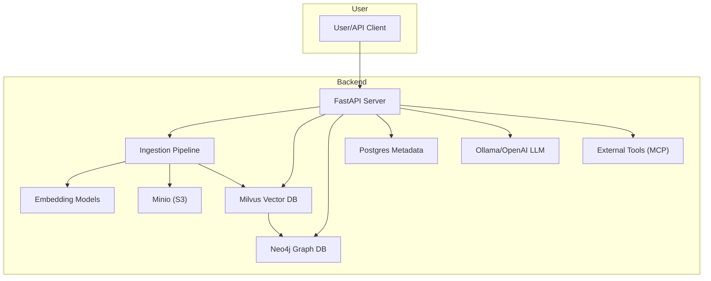
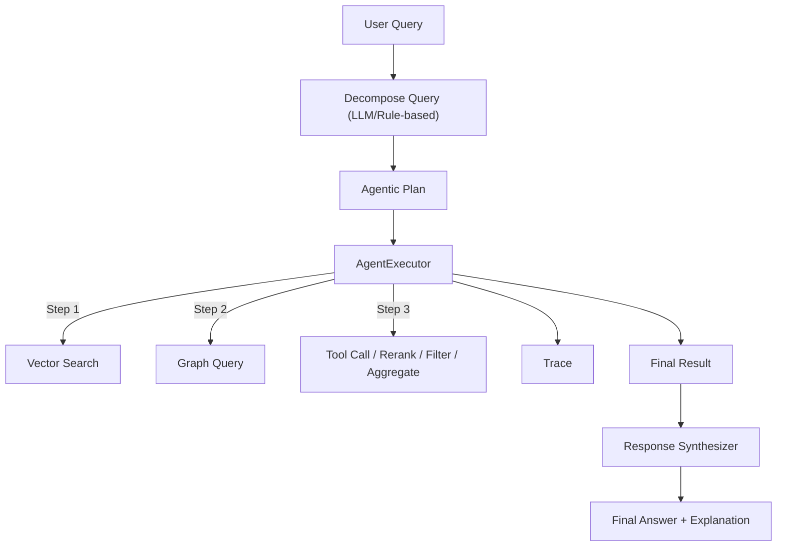
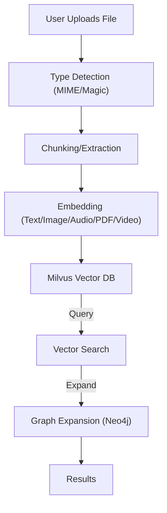

# Design Document: Agentic Multimodal RAG System

## 1. Purpose and Goals

The Agentic Multimodal RAG System is designed to provide a robust, extensible, and explainable platform for Retrieval-Augmented Generation (RAG) with advanced agentic capabilities. The system supports multimodal ingestion, hybrid vector and graph search, agentic query decomposition, tool use, and composable workflows for both research and production environments.

**Goals:**
- Support multimodal data (text, PDF, image, audio, video)
- Enable agentic, multi-step, and explainable query decomposition and execution
- Provide hybrid vector and graph search (context, semantic, temporal)
- Ensure scalability, security, and multi-tenancy
- Facilitate integration with external tools and APIs (MCP/tool_call)
- Maintain full traceability and explainability at every step

---

## 2. High-Level System Architecture

### 2.1 Architecture Overview

### 2.2 Data Flow

- **Ingestion:** User uploads document → type detection → extraction/chunking → embedding → storage (Milvus, Minio, Postgres)
- **Query:** User query (text/file) → embedding/model pipeline → vector search (Milvus) → graph expansion (Neo4j) → agentic plan execution (multi-step, tool use, etc.)
- **Agentic Execution:** AgentExecutor traverses the plan, invoking search, graph, tool_call, rerank, filter, aggregate, and LLM steps as needed.

---

## 3. Feature Design Details

### 3.1 Agentic RAG: Query Decomposition and Execution

**Purpose:**
- Decompose complex, multimodal user queries into structured, explainable, and multi-step plans.
- Enable advanced agentic behaviors (tool use, rerank, filter, aggregate, multi-hop, conditional, llm_call).

**Core Design:**
- See [plan_schema.md](feature/agentic_rag/plan_schema.md) for the full schema.
- Each plan consists of a list of `DecompositionStep` objects, each with:
  - `step_id`, `type`, `modality`, `parameters`, `dependencies`, `condition` (optional), `trace`.
- Supported step types:
  - `vector_search`, `graph_query`, `filter`, `rerank`, `tool_call`, `audio_transcription`, `aggregate`, `multi-hop`, `llm_call`, `conditional`.
- Plans are generated by the QueryDecomposer (LLM or rule-based) and executed by the AgentExecutor.
- Full traceability: every step includes a `trace` field for explainability and auditability.

**Advanced Agentic Step Types:**
- **tool_call:** Call external APIs/tools (e.g., MCP, plugins, web search). Parameters include endpoint, payload, headers. See [usage.md](feature/agentic_rag/usage.md#MCP-Tool-Call-Usage--Best-Practices).
- **rerank:** Rerank results from previous steps using a model or custom logic. Input step specified via parameters or dependencies. Output includes `rerank_method` for traceability.
- **filter:** Filter results by score, metadata, or other criteria. Input step and filter criteria specified in parameters. Output includes `filter_method`.
- **aggregate:** Combine results from multiple steps (union, intersection, etc.). Input steps and method specified in parameters. Output includes `aggregate_method`.
- **multi-hop:** Traverse the graph in multiple, dependent steps. Input step and number of hops specified in parameters. Output includes `multi_hop` field.
- **llm_call:** Use an LLM for synthesis, summarization, or reasoning at any step. Input step(s) and prompt specified in parameters. Output includes `llm_call` field.
- **conditional:** Branch logic based on previous step results. Condition specified as an expression referencing previous step results. Skipped steps are marked in the trace.

**Extensibility:**
- The schema and executor are designed for easy addition of new step types and behaviors.
- See [plan_schema.md](feature/agentic_rag/plan_schema.md) for extensibility notes and best practices.

**References:**
- [plan_schema.md](feature/agentic_rag/plan_schema.md)
- [usage.md](feature/agentic_rag/usage.md)
- [implementation_plan.md](feature/agentic_rag/implementation_plan.md)

---

### 3.2 Multimodal GraphRAG: Ingestion, Retrieval, and Graph Expansion

**Purpose:**
- Enable ingestion and retrieval of multimodal data (text, PDF, image, audio, video).
- Support hybrid vector and graph search, with context, semantic, and temporal expansion.

**Core Design:**
- Ingestion pipeline: file upload or text → type detection (MIME/magic) → extraction → chunking → embedding → storage (Milvus, Minio, Postgres).
- Embedding models:
  - Text: JinaAI, BGE-M3 (fallback)
  - Image/PDF: Nomic Multimodal
  - Audio: Whisper (transcribe, then embed)
  - Video: (future) Frame extraction + image embedding
- Query endpoints:
  - `/query/vector`: Unified endpoint for all modalities, routes to correct embedding/model
  - `/query/graph`: Expands search results with graph context (Neo4j), supports edge type/weight/metadata filters
- Graph schema: nodes = chunks, edges = semantic/contextual/temporal
- See [technical_design.md](feature/agentic-multimodal-graphrag/technical_design.md) and [usage.md](feature/agentic-multimodal-graphrag/usage.md)

**Extensibility:**
- Pluggable extractors and embedding models for new modalities
- Configurable graph schema and expansion logic
- See [future-graphrag-phase.md](feature/agentic-multimodal-graphrag/future-graphrag-phase.md) for advanced graph and agentic reasoning

**References:**
- [technical_design.md](feature/agentic-multimodal-graphrag/technical_design.md)
- [usage.md](feature/agentic-multimodal-graphrag/usage.md)
- [future-graphrag-phase.md](feature/agentic-multimodal-graphrag/future-graphrag-phase.md)

---

### 3.3 Edge-Graph: Configurable, Weighted, and Explainable Graph Expansion

**Purpose:**
- Provide fine-grained, config-driven control over graph expansion for RAG queries.
- Enable per-app edge type priorities, weighted expansion, post-expansion filtering, and full traceability.

**Core Design:**
- Config schema (YAML): defines default and per-app edge types and weights. Supports hot reload (see [technical_design.md](feature/edge-graph/technical_design.md)).
- API: `/query/graph` accepts `graph_expansion` parameters (edge_types, weights, depth, post_filter, explain, etc.). See [api_design.md](feature/edge-graph/api_design.md).
- Expansion logic:
  - On each query, load current config (from memory)
  - Determine edge types/weights (app override > global default > user/agent override)
  - Expand graph using Neo4j, filter and rerank as specified
  - Response includes traceability fields (`expanded_by`, `config_source`, `weight`, etc.)
- Filtering: API supports filtering by edge type, weight, and metadata (see [usage.md](feature/edge-graph/usage.md)).
- Hot reload: Config file changes are detected and reloaded without restart.

**Traceability and Explainability:**
- Every node/edge in the response includes trace fields
- API response includes `used_edge_types`, `post_filter`, and expansion trace

**Extensibility:**
- Add new edge types, weights, or app overrides by editing the config (no restart required)
- API and config are backward compatible

**References:**
- [technical_design.md](feature/edge-graph/technical_design.md)
- [api_design.md](feature/edge-graph/api_design.md)
- [usage.md](feature/edge-graph/usage.md)

---

## 4. Security, Scalability, and Extensibility

### 4.1 Security
- **Multi-tenancy:** Data isolation per app/user
- **Auth:** JWT/OAuth2 for API access
- **Environment Management:** Use of .env files for secrets, never commit secrets to version control
- **External Tool Calls:** Secure all endpoints and credentials (see Setup.md)

### 4.2 Scalability
- **Async FastAPI:** High concurrency and throughput
- **Milvus Sharding:** Scalable vector storage
- **Parallel Ingestion/Query:** Supports large-scale data and queries

### 4.3 Extensibility
- **Pluggable Pipelines:** Easy to add new modalities, extractors, or embedding models
- **Agentic Plan Schema:** Add new step types and agentic behaviors as needed
- **Config-driven:** All major components are configurable via environment and YAML

### 4.4 Explainability
- **Trace Fields:** Every step in the plan and execution includes trace metadata
- **Plan Traceability:** Full audit trail from user query to final answer
- **User Feedback:** Feedback endpoint for answer/explanation quality

---

## 5. Model Licensing and Compliance

- **JinaAI Embeddings:** Apache 2.0, free for commercial/research
- **Nomic Multimodal:** Apache 2.0, free for commercial/research
- **OpenAI Whisper:** MIT, free for commercial/research
- **Ollama Models:** See [Ollama model library](https://ollama.com/library) for model-specific licenses
- **Other models:** See HuggingFace model cards for details

---

## 6. References

- [Usage.md](Usage.md): Usage flows and examples
- [Setup.md](Setup.md): Setup and deployment
- [API.md](API.md): API reference and schemas
- [README.md](README.md): Project summary and quick links

---

## 7. Appendix: Detailed Diagrams

### 7.1 Agentic Plan Execution Flow

### 7.2 Multimodal Ingestion and Query Flow

---

*For more details, see the referenced documentation and codebase.* 