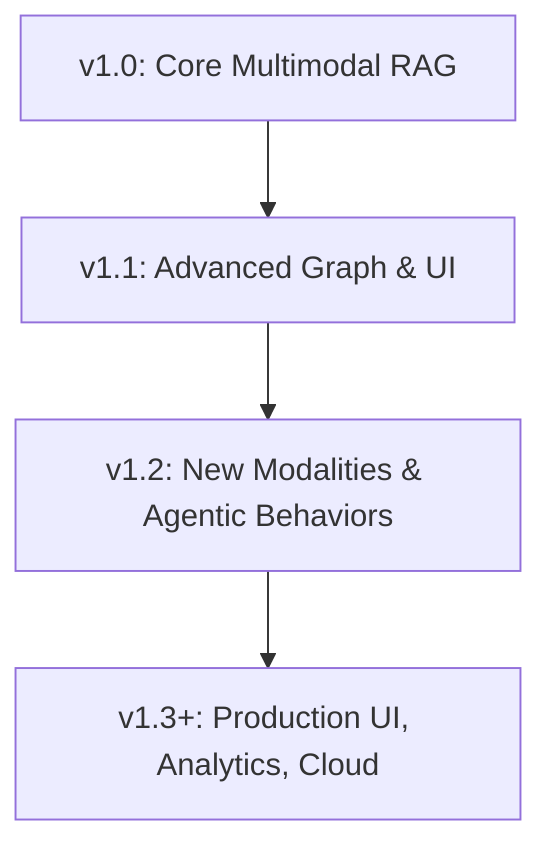

# Feature Roadmap: Agentic Multimodal RAG System

## Vision & Evolution

The Agentic Multimodal RAG System is committed to delivering a best-of-all-worlds, production-grade platform for explainable, composable, and multimodal Retrieval-Augmented Generation. Our roadmap is driven by real-world needs, community feedback, and the ongoing evolution of the RAG, graph, and agentic AI ecosystem.

---

## Roadmap Overview

| Status      | Feature/Area                | Description & Rationale                                                                 | Target Milestone |
|-------------|-----------------------------|-----------------------------------------------------------------------------------------|------------------|
| **✅ Done** | Multimodal Ingestion        | Ingest text, PDF, image, audio, video; auto type detection, chunking, embedding         | v1.0             |
| **✅ Done** | Vector Search (Milvus)      | Unified endpoint for all modalities, fast and scalable vector search                    | v1.0             |
| **✅ Done** | GraphRAG Query (Neo4j)      | Context, semantic, temporal expansion; config-driven edge types/weights                 | v1.0             |
| **✅ Done** | Agentic Query Decomposition | Multi-step, explainable plans (LLM/rule-based); advanced step types                     | v1.0             |
| **✅ Done** | Agentic Execution           | Step-by-step plan execution, tool_call, rerank, filter, aggregate, multi-hop, llm_call  | v1.0             |
| **✅ Done** | Traceability & Explainability| Full trace fields, step-by-step explanations, supporting evidence                       | v1.0             |
| **✅ Done** | Security & Multi-Tenancy    | JWT/OAuth2, per-app/user isolation, secure config/model management                      | v1.0             |
| **✅ Done** | Feedback & Prompt Tuning    | User feedback API, prompt versioning, explanation styles                                | v1.0             |
| **✅ Done** | Unit & Integration Testing  | Full coverage for all features, live service integration                                | v1.0             |
| **🟡 In Progress** | Advanced Graph Expansion    | Ontology-driven, multi-hop, and semantic/temporal expansion; richer edge types          | v1.1             |
| **🟡 In Progress** | UI/Visualization            | Interactive graph and plan visualization, user feedback dashboard                       | v1.1             |
| **🟡 In Progress** | Community Contributions     | Open issues, PRs, and feature requests; improved onboarding and docs                    | v1.1             |
| **⬜ Planned** | New Modalities (Video, 3D, etc.) | Video frame/scene embedding, 3D/AR/VR support, advanced multimodal fusion              | v1.2+            |
| **⬜ Planned** | Advanced Agentic Behaviors      | Multi-agent memory, temporal knowledge, agent collaboration, dynamic tool selection     | v1.2+            |
| **⬜ Planned** | Improved Explainability         | LLM-based, user-tunable explanations, advanced trace analytics                         | v1.2+            |
| **⬜ Planned** | Scalability & Performance       | Distributed ingestion/query, sharding, autoscaling, cloud-native deployment            | v1.2+            |
| **⬜ Planned** | Production UI & API Gateway     | User-facing web UI, API gateway, RBAC, analytics                                       | v1.3+            |

---

## Feature Details & Future Directions

### Agentic RAG
- **Completed:** Multi-step, multimodal, and agentic plan schema; advanced step types (tool_call, rerank, filter, aggregate, multi-hop, llm_call, conditional); full traceability.
- **Planned:** Multi-agent memory, agent collaboration, dynamic tool selection, user feedback loop.

### Multimodal GraphRAG
- **Completed:** Ingestion and retrieval for text, PDF, image, audio; config-driven graph expansion; Neo4j integration.
- **Planned:** Video/scene/3D ingestion, ontology-driven expansion, advanced graph analytics.

### Edge-Graph
- **Completed:** Configurable, weighted, filterable expansion; per-app overrides; hot reload; traceability fields.
- **Planned:** Ontology/knowledge-driven expansion, richer edge types, advanced filtering/reranking.

### API & UI
- **Completed:** Unified, OpenAPI-documented endpoints; feedback API; health checks.
- **In Progress:** Interactive UI for graph/plan visualization, user feedback dashboard.
- **Planned:** Full-featured web UI, API gateway, RBAC, analytics.

### Security & Compliance
- **Completed:** JWT/OAuth2, per-app/user isolation, secure config/model management.
- **Planned:** RBAC, audit logging, advanced compliance features.

### Testing & DevOps
- **Completed:** Full unit/integration test coverage, live service integration, CI-ready.
- **Planned:** Distributed test harness, cloud-native deployment, autoscaling.

---

## Diagrams

### Roadmap Phases

---

## References & Cross-Links
- [Design.md](Design.md)
- [Usage.md](Usage.md)
- [API.md](API.md)
- [Setup.md](Setup.md)
- [feature/agentic_rag/implementation_plan.md](feature/agentic_rag/implementation_plan.md)
- [feature/agentic-multimodal-graphrag/technical_design.md](feature/agentic-multimodal-graphrag/technical_design.md)
- [feature/edge-graph/technical_design.md](feature/edge-graph/technical_design.md)

---

*This roadmap is updated regularly. Community feedback and contributions are welcome!* 