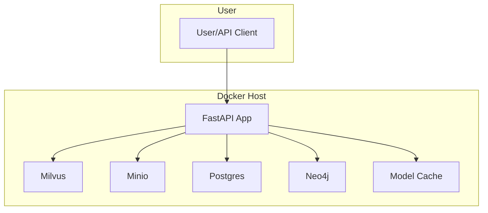

# Setup Guide: Agentic Multimodal RAG System

## 1. Overview

This guide provides step-by-step instructions to set up the Agentic Multimodal RAG System for both Docker-based deployment and local development. It covers model downloads, environment configuration, LLM backend setup (OpenAI/Ollama), agentic tool call integration (MCP), security best practices, and troubleshooting.

---

## 2. System Requirements

- **Docker** and **Docker Compose** (for containerized deployment)
- **Python 3.11+** (for local development)
- **Conda** and **Poetry** (for local development and testing)
- **Sufficient disk space** for model files (10GB+ recommended)
- **Internet access** (for initial model downloads)

---

## 3. Quick Docker Setup

### 3.1 Clone the Repository
```bash
git clone <repo-url>
cd <repo-root>
```

### 3.2 Configure Environment Variables
- Copy `.env.example` to `.env` and edit as needed:
  ```bash
  cp .env.example .env
  # Edit .env with your preferred editor
  ```
- Key variables:
  - `MILVUS_HOST`, `MILVUS_PORT`: Vector DB
  - `MINIO_HOST`, `MINIO_ACCESS_KEY`, `MINIO_SECRET_KEY`: S3-compatible storage
  - `POSTGRES_HOST`, `POSTGRES_USER`, `POSTGRES_PASSWORD`, `POSTGRES_DB`: Metadata DB
  - `NEO4J_URI`, `NEO4J_AUTH`: Graph DB
  - `HF_HOME`, `TRANSFORMERS_CACHE`: Model cache directory
  - `LLM_BACKEND`: LLM backend for agentic plan decomposition (`openai`, `local`, or `mock`)
  - `OLLAMA_HOST`, `OLLAMA_PORT`, `OLLAMA_MODEL`: For local LLM backend (Ollama)
  - `OPENAI_API_KEY`: For OpenAI LLM backend (future support)

### 3.3 Download Required Models

#### Text Embedding Model (JinaAI)
- **Model:** `jinaai/jina-embeddings-v2-base-en`
- **License:** Apache 2.0 (see [JinaAI Model Card](https://huggingface.co/jinaai/jina-embeddings-v2-base-en))
- **How to Download:**
  - Download from HuggingFace and place in `/Volumes/ssd/mac/models/jinaai__jina-embeddings-v2-base-en/`
  - Or use the provided download script (see scripts folder)

#### Multimodal Model (Nomic)
- **Model:** `nomic-ai/colnomic-embed-multimodal-7b`
- **License:** Apache 2.0 (see [Nomic Model Card](https://huggingface.co/nomic-ai/colnomic-embed-multimodal-7b))
- **How to Download:**
  - Download from HuggingFace and place in `/Volumes/ssd/mac/models/nomic-ai__colnomic-embed-multimodal-7b/`

#### Audio Model (OpenAI Whisper)
- **Model:** `openai/whisper-base`
- **License:** MIT (see [Whisper Model Card](https://huggingface.co/openai/whisper-base))
- **How to Download:**
  - Download from HuggingFace and place in `/Volumes/ssd/mac/models/openai__whisper-base/`

#### Model Download Script
- Use the helper script in the `scripts/` folder to automate downloads and verify hashes:
  ```bash
  poetry run python scripts/download_models.py
  ```
- **Note:** The script does NOT download LLMs for Ollama or any tool selection models. You must pull Ollama models manually.
- Ensure all models are present in the directory specified by `HF_HOME` and `TRANSFORMERS_CACHE`.

### 3.4 Start the System
```bash
docker compose up --build
```
- The API will be available at [http://localhost:8000](http://localhost:8000)

---

## 4. LLM Backend Setup (Agentic Plan Decomposition)

The system supports two LLM backends for agentic plan decomposition:

### 4.1 OpenAI API (future support)
- Set `LLM_BACKEND=openai` in your `.env` file.
- Set `OPENAI_API_KEY` to your OpenAI API key.
- **Note:** OpenAI backend is not yet implemented, but environment variables are reserved for future use.

### 4.2 Local LLM (Ollama)
- Set `LLM_BACKEND=local` in your `.env` file.
- Set `OLLAMA_HOST` (default: `localhost`), `OLLAMA_PORT` (default: `11434`), and `OLLAMA_MODEL` (default: `deepseek-r1:8b`).
- **How to run Ollama:**
  1. [Install Ollama](https://ollama.com/download) on your machine (not included in docker-compose).
  2. Start the Ollama server:
     ```bash
     ollama serve
     ```
  3. Pull the required model (e.g., deepseek-r1:8b):
     ```bash
     ollama pull deepseek-r1:8b
     ```
  4. Ensure the model name in `OLLAMA_MODEL` matches the pulled model.
- **Note:** The model download script does NOT handle Ollama models. You must pull them manually.

### 4.3 Mock Backend (for testing)
- Set `LLM_BACKEND=mock` to use a hardcoded plan for unit tests.

---

## 5. Agentic Tool Calls & MCP Integration

### 5.1 FastAPI MCP Integration (Automatic Endpoint Exposure)

The system includes **FastAPI MCP** integration that automatically exposes all FastAPI endpoints as MCP tools for use by agents.

- **Automatic Tool Discovery:** All FastAPI endpoints are automatically exposed as MCP tools at `/mcp` endpoint.
- **No Additional Configuration:** The MCP server is automatically mounted when the application starts (if `fastapi-mcp` is installed).
- **Tool Naming:** Endpoints use their `operation_id` for tool naming (e.g., `query_vector`, `ingest_document`, `decompose_query`).
- **List Available Tools:** Use `GET /agent/tools/list` to see all available MCP tools.

**To use FastAPI MCP tools in agentic plans:**
```json
{
  "step_id": 1,
  "type": "tool_call",
  "modality": "text",
  "parameters": {
    "tool": "fastapi_mcp",
    "tool_name": "query_vector",
    "arguments": {
      "query": "What is GraphRAG?",
      "app_id": "myapp",
      "user_id": "user1"
    }
  }
}
```

### 5.2 External MCP Tool Calls

- **MCP/tool_call steps** in agentic plans allow calling external APIs/tools (e.g., web search, plugins, custom endpoints).
- **No model download is required** for tool selection/tool_call/MCP. These steps are executed by making HTTP requests to user-supplied endpoints.
- **To use external MCP/tool_call:**
  - Specify the endpoint, payload, and headers in the agentic plan step (see Usage.md and API.md for examples).
  - You are responsible for providing and securing any required endpoints, credentials, or tokens for external tools.

**Example external MCP tool call:**
```json
{
  "step_id": 2,
  "type": "tool_call",
  "modality": "text",
  "parameters": {
    "tool": "mcp",
    "endpoint": "https://external-api.example.com/tool",
    "payload": {"query": "foo"},
    "headers": {"Authorization": "Bearer <token>"}
  }
}
```

---

## 6. Download Required Embedding Models

#### Text Embedding Model (JinaAI)
- **Model:** `jinaai/jina-embeddings-v2-base-en`
- **License:** Apache 2.0 (see [JinaAI Model Card](https://huggingface.co/jinaai/jina-embeddings-v2-base-en))
- **How to Download:**
  - Download from HuggingFace and place in `/Volumes/ssd/mac/models/jinaai__jina-embeddings-v2-base-en/`
  - Or use the provided download script (see scripts folder)

#### Multimodal Model (Nomic)
- **Model:** `nomic-ai/colnomic-embed-multimodal-7b`
- **License:** Apache 2.0 (see [Nomic Model Card](https://huggingface.co/nomic-ai/colnomic-embed-multimodal-7b))
- **How to Download:**
  - Download from HuggingFace and place in `/Volumes/ssd/mac/models/nomic-ai__colnomic-embed-multimodal-7b/`

#### Audio Model (OpenAI Whisper)
- **Model:** `openai/whisper-base`
- **License:** MIT (see [Whisper Model Card](https://huggingface.co/openai/whisper-base))
- **How to Download:**
  - Download from HuggingFace and place in `/Volumes/ssd/mac/models/openai__whisper-base/`

#### Model Download Script
- Use the helper script in the `scripts/` folder to automate downloads and verify hashes:
  ```bash
  poetry run python scripts/download_models.py
  ```
- **Note:** The script does NOT download LLMs for Ollama or any tool selection models. You must pull Ollama models manually.
- Ensure all models are present in the directory specified by `HF_HOME` and `TRANSFORMERS_CACHE`.

---

## 7. Local Development Setup

### 7.1 Install Dependencies
```bash
conda create -n rag-py311 python=3.11
conda activate rag-py311
poetry install
```

### 7.2 Configure Environment Variables
- Copy `.env.example` to `.env` and edit as needed.
- Set `HF_HOME` and `TRANSFORMERS_CACHE` to your local model directory.

### 7.3 Download Models
- Follow the same steps as in Docker setup for model downloads.

### 7.4 Start Services
- Start Milvus, Minio, Postgres, and Neo4j locally (see docker-compose.yml for service configs)
- Or use Docker Compose for all dependencies:
  ```bash
  docker compose up milvus minio postgres neo4j
  ```
- Start the FastAPI app:
  ```bash
  poetry run uvicorn app.main:app --reload
  ```

---

## 8. Model Licensing Notes

- **JinaAI Embeddings:** Apache 2.0, free for commercial and research use.
- **Nomic Multimodal:** Apache 2.0, free for commercial and research use.
- **OpenAI Whisper:** MIT, free for commercial and research use.
- **Ollama Models:** See [Ollama model library](https://ollama.com/library) for model-specific licenses.
- **Other models:** See respective HuggingFace model cards for details.

---

## 9. Security Best Practices

- **Environment Variables:** Never commit `.env` files with secrets to version control.
- **Credentials:** Use strong, unique passwords for all services (Minio, Postgres, Neo4j).
- **Network:** Restrict access to database and storage services to trusted networks.
- **JWT/OAuth:** Use secure tokens for API authentication (see Design.md for auth architecture).
- **Model Files:** Ensure model directories are not world-writable.
- **Production:** Use HTTPS and secure reverse proxies in production deployments.
- **MCP/tool_call:** Secure all external endpoints and credentials; never expose sensitive tokens in code or logs.

---

## 10. Deployment Architecture Diagram



---

## 11. Troubleshooting

- **Model file missing:** Ensure all required models are downloaded and placed in the correct directory (`HF_HOME`).
- **Ollama LLM issues:** Ensure Ollama is running, the required model is pulled, and `OLLAMA_HOST`, `OLLAMA_PORT`, and `OLLAMA_MODEL` are set correctly.
- **OpenAI LLM issues:** Ensure `OPENAI_API_KEY` is set (future support).
- **MCP/tool_call errors:** Check that the endpoint is reachable, credentials are valid, and the payload is correct.
- **Service connection errors:** Check that Milvus, Minio, Postgres, and Neo4j are running and accessible.
- **Port conflicts:** Make sure required ports (8000, 19530, 9000, 5432, 7687) are not in use by other processes.
- **Docker issues:** Try `docker compose down -v` to reset volumes and containers.
- **Authentication errors:** Double-check credentials in your `.env` file.

---

## 12. References

- [Usage.md](Usage.md): How to use the system
- [Design.md](Design.md): System and feature design
- [README.md](README.md): Project summary and quick links
- [API.md](API.md): API reference and schemas

---

## 13. Feature-Specific Setup & Configuration

### 13.1 Agentic RAG (Query Decomposition & Execution)
- **Enable advanced agentic steps:**
  - Set `LLM_BACKEND` in `.env` to `local` (Ollama) or `openai` (future) for LLM-based plan decomposition.
  - To use advanced steps (tool_call, rerank, filter, aggregate, multi-hop, llm_call, conditional), see [feature/agentic_rag/implementation_plan.md](feature/agentic_rag/implementation_plan.md) and [usage.md](feature/agentic_rag/usage.md).
  - All step types are enabled by default; test with the `/agent/query/decompose` and `/agent/execute` endpoints.
  - For custom tool_call/MCP endpoints, ensure endpoints and credentials are configured securely (see Security section).

### 13.2 Multimodal GraphRAG
- **Dependencies:**
  - PDF extraction: `PyMuPDF (fitz)`, `pdfminer.six`, or similar
  - Image embedding: `Pillow`, `nomic-ai/colnomic-embed-multimodal-7b` model
  - Audio: `openai/whisper-base` model, `whisper` Python package
  - Video: (future) `opencv-python`, frame extraction tools
- **Model requirements:** See [technical_design.md](feature/agentic-multimodal-graphrag/technical_design.md)
- **Setup:** Ensure all models are downloaded and present in `HF_HOME`/`TRANSFORMERS_CACHE`.
- **Test:** Use `/docs/ingest` and `/query/vector` endpoints for all modalities.

### 13.3 Edge-Graph (Configurable, Weighted, Filterable Expansion)
- **Config file:** Place `edge_types.yaml` or `edge_graph.yaml` in the `config/` directory.
- **Config schema:** See [technical_design.md](feature/edge-graph/technical_design.md) and [usage.md](feature/edge-graph/usage.md)
- **Hot reload:** The app will auto-reload config on file changes (no restart needed).
- **Per-app overrides:** Add app-specific edge types/weights in the config YAML.
- **Verify:** Make `/query/graph` calls and check traceability fields in responses.
- **Troubleshooting:** See [usage.md](feature/edge-graph/usage.md#Step-by-Step-Modifying-and-Using-the-Edge-Types-Config)

---

## 14. Security Best Practices (Expanded)
- **Tool Call/MCP:** Never expose sensitive tokens in code or logs. Restrict allowed endpoints. Use HTTPS for all external calls.
- **Config Files:** Store YAML configs securely, restrict permissions, and never commit secrets.
- **Model Files:** Ensure model directories are not world-writable. Validate hashes after download.
- **API Auth:** Use JWT/OAuth2 for all API endpoints (see Design.md).
- **Environment:** Use `.env` for secrets, never commit to version control.

---

## 15. Troubleshooting (Expanded)
- **Agentic Plan/Execution Issues:**
  - Check LLM backend config, model availability, and endpoint logs.
  - For tool_call errors, verify endpoint, payload, and credentials.
  - For conditional/aggregate/multi-hop issues, check plan structure and dependencies.
- **Graph Expansion/Config Issues:**
  - Validate YAML config, check for hot reload, and use correct app names for overrides.
  - For missing/incorrect edge types/weights, check config and logs.
- **Embedding/Model Issues:**
  - Ensure all required models are present and hashes match.
  - For modality-specific errors, check dependencies (PyMuPDF, Pillow, whisper, etc.).
- **General:**
  - See feature docs and tracker for up-to-date troubleshooting steps.

---

## 16. Cross-References
- [Agentic RAG Implementation Plan](feature/agentic_rag/implementation_plan.md)
- [Multimodal GraphRAG Technical Design](feature/agentic-multimodal-graphrag/technical_design.md)
- [Edge-Graph Technical Design](feature/edge-graph/technical_design.md)
- [Edge-Graph Usage](feature/edge-graph/usage.md)
- [Feature Tracker](feature/edge-graph/tracker.md) 