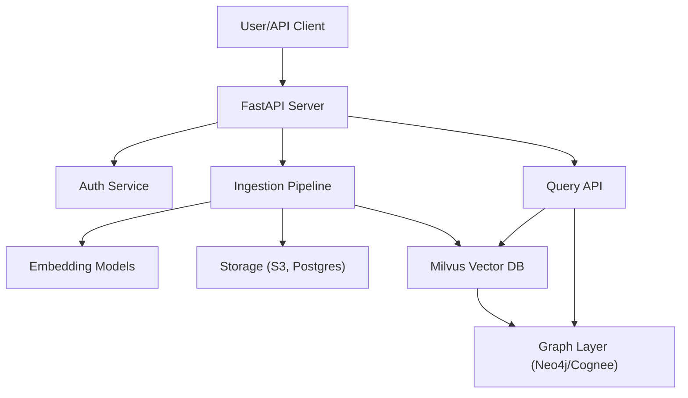
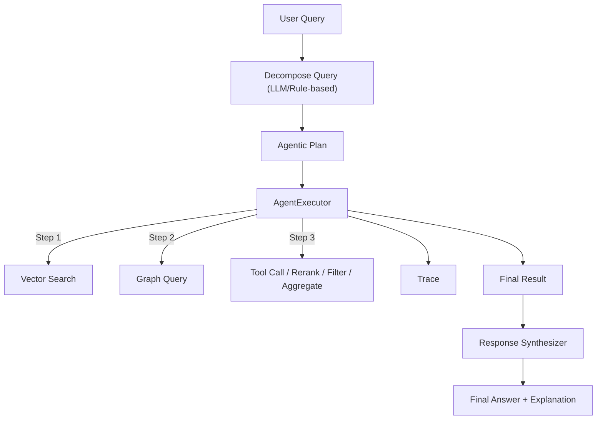
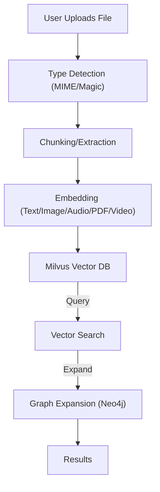

# Usage Guide: Agentic Multimodal RAG System

## 1. Introduction

The Agentic Multimodal RAG System is a production-ready, highly extensible Retrieval-Augmented Generation (RAG) platform that supports:
- **Multimodal document ingestion** (text, PDF, image, audio, video)
- **Hybrid vector and graph search** (context, semantic, temporal)
- **Agentic query decomposition and execution** (multi-step, tool-using, explainable)
- **Advanced agentic behaviors** (tool calls, rerank, filter, aggregate, multi-hop, LLM synthesis)
- **Scalable, multi-tenant architecture** (per-app, per-user isolation)
- **Explainability and traceability** at every step

It is designed for both developers and end-users who need advanced, explainable, and composable RAG workflows in research, enterprise, or production environments.

---

## 2. System Capabilities

- **Multimodal Ingestion:**  Ingest and index documents of any type (text, PDF, image, audio, video) with automatic type detection, chunking, and embedding.
- **Vector Search:**  Query the system with text or files; the system automatically routes to the correct embedding/model pipeline and returns the most relevant results.
- **GraphRAG (Graph Query):**  Expand search results with context, semantic, and temporal graph expansion using Neo4j, with configurable edge types, weights, and filters.
- **Agentic Query Decomposition:**  Decompose complex queries into multi-step, explainable plans using LLMs or rule-based logic. Plans can include search, graph, tool calls, rerank, filter, aggregate, and more.
- **Agentic Execution:**  Execute agentic plans step-by-step, with full traceability and explainability of each step and result.
- **Tool Use and Advanced Behaviors:**  Integrate external tools (via MCP), rerank/filter/aggregate results, perform multi-hop graph traversals, and synthesize answers with LLMs.
- **Traceability and Explainability:**  Every step in the agentic plan and execution is fully traceable, with detailed explanations and evidence.

---

## 3. Getting Started (Quickstart)

### Prerequisites
- Docker and Docker Compose installed
- Access to required models (see Setup.md for details)
- Python 3.11+ (for local development)
- Conda and Poetry (for local development and testing)

### Quickstart: Running the System
```bash
# Clone the repository
git clone <repo-url>
cd <repo-root>

# (Optional) Set up environment variables in .env

# Start the system with Docker Compose
docker compose up --build

# The API will be available at http://localhost:8000
```

### First Query Example
```bash
# Ingest a PDF document
curl -X POST http://localhost:8000/docs/ingest \
  -F "file=@mydoc.pdf" \
  -F "app_id=myapp" \
  -F "user_id=user1"

# Query with text
curl -X POST http://localhost:8000/query/vector \
  -H "Content-Type: application/json" \
  -d '{"query": "What are the main findings?", "app_id": "myapp", "user_id": "user1"}'
```

---

## 4. Detailed Usage Scenarios

### 4.1 Ingesting Documents

#### Supported Formats
- Text files (.txt, .md, etc.)
- PDF documents
- Images (.jpg, .png, etc.)
- Audio files (.mp3, .wav, etc.)
- Video files (.mp4, .mov, etc.) *(future phase)*

#### Example: Ingesting a PDF
```bash
curl -X POST http://localhost:8000/docs/ingest \
  -F "file=@mydoc.pdf" \
  -F "app_id=myapp" \
  -F "user_id=user1"
```

#### Example: Ingesting an Image
```bash
curl -X POST http://localhost:8000/docs/ingest \
  -F "file=@myimage.jpg" \
  -F "app_id=myapp" \
  -F "user_id=user1"
```

#### Example: Ingesting Audio
```bash
curl -X POST http://localhost:8000/docs/ingest \
  -F "file=@myaudio.mp3" \
  -F "app_id=myapp" \
  -F "user_id=user1"
```

---

### 4.2 Querying the System

#### Vector Search (Text Query)
```bash
curl -X POST http://localhost:8000/query/vector \
  -H "Content-Type: application/json" \
  -d '{"query": "What is GraphRAG?", "app_id": "myapp", "user_id": "user1"}'
```

#### Vector Search (Image Query)
```bash
curl -X POST http://localhost:8000/query/vector \
  -F "file=@myimage.jpg" \
  -F "app_id=myapp" \
  -F "user_id=user1"
```

#### Vector Search (Audio Query)
```bash
curl -X POST http://localhost:8000/query/vector \
  -F "file=@myaudio.mp3" \
  -F "app_id=myapp" \
  -F "user_id=user1"
```

#### GraphRAG Query (with Graph Expansion)
```bash
curl -X POST http://localhost:8000/query/graph \
  -H "Content-Type: application/json" \
  -d '{
    "query": "What happened last week?",
    "app_id": "myapp",
    "user_id": "user1",
    "graph_expansion": {"depth": 2, "type": "semantic", "time_window": "7d"},
    "filters": {"doc_type": "pdf"}
  }'
```

#### GraphRAG Query (Image, with Expansion)
```bash
curl -X POST http://localhost:8000/query/graph \
  -F "file=@myimage.jpg" \
  -F "app_id=myapp" \
  -F "user_id=user1" \
  -F 'graph_expansion={"depth": 1, "type": "context"}'
```

---

### 4.3 Agentic Query Decomposition

#### Decompose a Complex Query
```bash
curl -X POST http://localhost:8000/agent/query/decompose \
  -H "Content-Type: application/json" \
  -d '{
    "query": "Summarize the main findings from the attached PDF and find related images.",
    "app_id": "myapp",
    "user_id": "user1",
    "modality": "multimodal",
    "context": {}
  }'
```

**Response Example:**
```json
{
  "plan": [
    {
      "step_id": 1,
      "type": "vector_search",
      "modality": "text",
      "parameters": {"query": "What is the summary?"},
      "dependencies": [],
      "trace": {"source": "rule-based", "explanation": "Rule-based agentic decomposition", "step": "vector_search"}
    },
    {
      "step_id": 2,
      "type": "graph_query",
      "modality": "image",
      "parameters": {"related_to": "results from step 1"},
      "dependencies": [1],
      "trace": {"source": "rule-based", "explanation": "Rule-based agentic decomposition", "step": "graph_query"}
    }
  ],
  "traceability": true
}
```

---

### 4.4 Agentic Plan Execution

#### Execute an Agentic Plan
```bash
curl -X POST http://localhost:8000/agent/execute \
  -H "Content-Type: application/json" \
  -d '{
    "plan": [
      {"step_id": 1, "type": "vector_search", "modality": "text", "parameters": {"query": "foo"}, "dependencies": [], "trace": {}},
      {"step_id": 2, "type": "tool_call", "modality": "text", "parameters": {"tool": "mcp", "endpoint": "https://mcp.example.com/api/tool", "payload": {"query": "foo"}, "headers": {"Authorization": "Bearer <token>"}}, "dependencies": [1], "trace": {}}
    ],
    "traceability": true,
    "app_id": "myapp",
    "user_id": "user1"
  }'
```

#### Synthesize a Final Answer
```bash
curl -X POST http://localhost:8000/agent/answer \
  -H "Content-Type: application/json" \
  -d '{
    "plan": {"plan": [ ... ], "traceability": true},
    "execution_trace": [ ... ],
    "app_id": "myapp",
    "user_id": "user1",
    "explanation_style": "for a 5th grader",
    "prompt_version": "v2"
  }'
```

---

### 4.5 Advanced Agentic Behaviors

- **Tool Calls:** Integrate external APIs or plugins via MCP tool_call steps.
- **Rerank:** Rerank results from previous steps using custom logic or models.
- **Filter:** Filter results by score, metadata, or other criteria.
- **Aggregate:** Combine results from multiple steps (union, intersection, etc.).
- **Multi-hop:** Traverse the graph in multiple, dependent steps.
- **LLM Call:** Use an LLM for synthesis, summarization, or reasoning at any step.

**See [API.md](API.md) for full schema and examples for each step type.**

---

### 4.6 Advanced Agentic Step Types & Composability

#### Tool Call (MCP/External API)
- **Example:** See [Agentic RAG Usage: MCP Tool Call](feature/agentic_rag/usage.md#MCP-Tool-Call-Usage--Best-Practices)
- **Best Practices:** Use outputs as inputs, handle errors, secure endpoints, use trace fields for auditability.

#### Rerank
- **Example:**
```json
{
  "plan": [
    {"step_id": 1, "type": "vector_search", ...},
    {"step_id": 2, "type": "rerank", "parameters": {"input_step": 1}, "dependencies": [1], ...}
  ]
}
```
- **Best Practices:** Specify input step, chain with filter/aggregate, use `rerank_method` in output.

#### Filter
- **Example:**
```json
{
  "plan": [
    {"step_id": 1, "type": "vector_search", ...},
    {"step_id": 2, "type": "filter", "parameters": {"input_step": 1, "min_score": 0.8, "metadata": {"label": "important"}}, "dependencies": [1], ...}
  ]
}
```
- **Best Practices:** Use for post-search selection, combine with rerank/aggregate, see [usage.md](feature/agentic_rag/usage.md#Filter-Step-Usage).

#### Aggregate
- **Example:**
```json
{
  "plan": [
    {"step_id": 1, "type": "vector_search", ...},
    {"step_id": 2, "type": "graph_query", ...},
    {"step_id": 3, "type": "aggregate", "parameters": {"input_steps": [1, 2], "method": "union"}, "dependencies": [1, 2], ...}
  ]
}
```
- **Best Practices:** Combine results from multiple steps, specify method, see [usage.md](feature/agentic_rag/usage.md#Aggregate-Step-Usage).

#### Multi-hop
- **Example:**
```json
{
  "plan": [
    {"step_id": 1, "type": "graph_query", ...},
    {"step_id": 2, "type": "multi-hop", "parameters": {"input_step": 1, "hops": 2}, "dependencies": [1], ...}
  ]
}
```
- **Best Practices:** Use for advanced graph traversal, specify hops, see [usage.md](feature/agentic_rag/usage.md#Multi-hop-Step-Usage).

#### LLM Call
- **Example:**
```json
{
  "plan": [
    {"step_id": 1, "type": "vector_search", ...},
    {"step_id": 2, "type": "llm_call", "parameters": {"input_step": 1, "prompt": "Summarize the results."}, "dependencies": [1], ...}
  ]
}
```
- **Best Practices:** Use for synthesis/summarization, specify prompt, see [usage.md](feature/agentic_rag/usage.md#LLM-Call-Step-Usage).

#### Conditional
- **Example:**
```json
{
  "plan": [
    {"step_id": 1, "type": "tool_call", ...},
    {"step_id": 2, "type": "tool_call", ... , "condition": "step_1.result['run'] == True"}
  ]
}
```
- **Best Practices:** Use for dynamic branching, reference previous step results, see [plan_schema.md](feature/agentic_rag/plan_schema.md#Conditional-Steps).

---

### 4.7 Edge-Graph: Config-Driven, Weighted, and Filtered Expansion

- **Config Setup:** See [Edge-Graph Usage](feature/edge-graph/usage.md) and [technical_design.md](feature/edge-graph/technical_design.md)
- **API Example:**
```json
{
  "query": "What is the context of X?",
  "app_id": "myapp",
  "user_id": "user1",
  "filters": {
    "edge_types": ["context_of", "temporal_neighbor"],
    "min_weight": 0.5,
    "metadata": {"label": "important"}
  },
  "graph_expansion": {
    "depth": 2,
    "type": "context_of"
  }
}
```
- **Response:** Includes `graph_context` with traceability fields (`expanded_by`, `config_source`, `weight`, etc.), see [usage.md](feature/edge-graph/usage.md#Filtering-by-Edge-Type-Weight-and-Metadata).
- **Troubleshooting:** YAML config issues, hot reload, app-specific overrides, see [usage.md](feature/edge-graph/usage.md#Step-by-Step-Modifying-and-Using-the-Edge-Types-Config).

---

### 4.8 Multimodal Ingestion & Query: Advanced Flows

- **PDF/Image/Audio/Video:** See [usage.md](feature/agentic-multimodal-graphrag/usage.md#2-Ingesting-Documents) and [technical_design.md](feature/agentic-multimodal-graphrag/technical_design.md)
- **Graph Expansion:** Use `/query/graph` with multimodal queries, see [usage.md](feature/agentic-multimodal-graphrag/usage.md#6-GraphRAG-Query-API-Usage-querygraph)
- **Best Practices:** Use recommended extraction/chunking libraries, ensure model files are present, see [usage.md](feature/agentic-multimodal-graphrag/usage.md#7-Recommended-Extraction--Chunking-LibrariesAPIs-20242025)

---

### 4.9 Chaining and Composing Agentic Plans

- **Composability:** Chain multiple advanced steps (search → filter → rerank → tool_call → aggregate → llm_call) for complex workflows.
- **Traceability:** Use the `trace` field in each step for debugging and auditability.
- **Feedback:** Use the feedback API to improve answer/explanation quality.
- **See Also:** [usage.md](feature/agentic_rag/usage.md#Best-Practices-for-ChainingCombining-MCP-tool_calls)

---

### 4.10 Best Practices & Troubleshooting

- **Agentic Plan Design:** Start simple, add complexity as needed, use explicit dependencies and trace fields.
- **Embedding/Model Issues:** Ensure all model files are present, check logs for errors, see Setup.md for troubleshooting.
- **Config Issues:** Validate YAML, check for hot reload, use correct app names for overrides.
- **Tool Call Security:** Never expose sensitive tokens, use secure endpoints, see Design.md and Setup.md.
- **Graph Expansion:** Use config-driven edge types/weights, verify expansion with trace fields.
- **Testing:** Use unit/integration tests for all new logic, see feature docs for test coverage.

---

### 4.11 Cross-References & Roadmap

- [Agentic RAG Usage](feature/agentic_rag/usage.md)
- [Multimodal GraphRAG Usage](feature/agentic-multimodal-graphrag/usage.md)
- [Edge-Graph Usage](feature/edge-graph/usage.md)
- [Feature Roadmap](ROADMAP.md)
- [Contribution & Security](README.md#Contribution--Security)

---

## 5. Diagrams

### 5.1 System Overview



### 5.2 Agentic Plan Execution Flow



### 5.3 Multimodal Ingestion and Query Flow



---

## 6. Running Unit and Integration Tests

- **Unit Tests:**  Run with mocks for all core logic.
  ```bash
  ENV=test poetry run pytest tests/unit
  ```

- **Integration Tests:**  Run with live services (Milvus, Neo4j, Minio, Postgres).
  ```bash
  ENV=test poetry run pytest tests/integratione2e
  ```

- All integration tests (including audio) require model files to be present locally (see Setup.md).

---

## 7. Troubleshooting & FAQ

- **Q:** Why do I get a "model file missing" error?  
  **A:** Ensure all required models are downloaded and placed in the correct local directory. See Setup.md for details.

- **Q:** How do I add a new modality or embedding model?  
  **A:** Implement a new extractor/embedding pipeline and register it in the ingestion logic.

- **Q:** How do I secure my deployment?  
  **A:** See Setup.md and Design.md for security best practices.

- **Q:** How do I contribute?  
  **A:** See the Contribution section in README.md.

---

## 8. References

- [API.md](API.md): Full API reference and schemas
- [Design.md](Design.md): System and feature design
- [Setup.md](Setup.md): Setup and deployment instructions
- [README.md](README.md): Project summary and quick links
- [ROADMAP.md](ROADMAP.md): Feature roadmap and future plans 