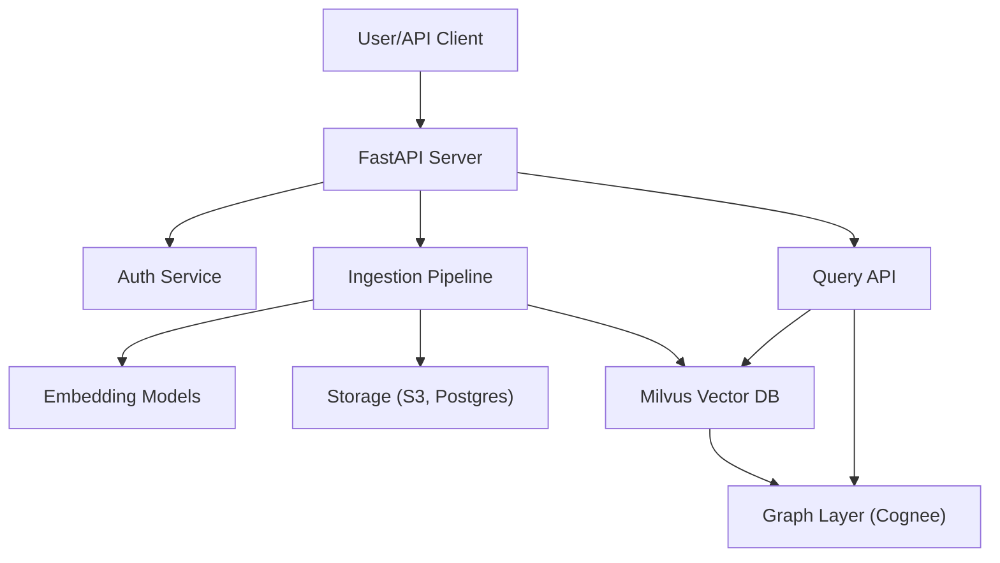

# Architecture Document: Agentic Multimodal GraphRAG

## 1. High-Level Architecture

- **API Layer**: FastAPI, async, OpenAPI docs
- **Vector DB**: Milvus, multi-tenant collections
- **Graph Layer**: Cognee graphquery, custom graph schema for temporal/contextual links
- **Storage**: S3-compatible for raw docs, metadata in Postgres
- **Auth**: JWT/OAuth2, per-user/app isolation
- **Ingestion**: Multimodal (text, PDF, image, audio), chunking, embedding
- **Query**: Hybrid vector+graph search, temporal filters, context expansion

## 2. Architecture Diagram

## 3. Key Flows

### Ingestion
- User uploads document (any modality)
- Pipeline: type detection → extraction → chunking → embedding → storage (Milvus/S3/Postgres)
- Graph edges created for context, time, semantics

### Query
- User query → vector search (Milvus)
- Graph expansion (context, time) via Cognee
- Results reranked and returned

## 4. Component Descriptions

- **FastAPI Server**: Handles all API requests, async for scalability
- **Auth Service**: JWT/OAuth2, multi-user/app isolation
- **Ingestion Pipeline**: Modular, supports text, PDF, image, audio; uses pluggable extractors and embedding models
- **Embedding Models**: OpenAI, HuggingFace, CLIP, Whisper, etc.
- **Storage**: S3 for raw files, Postgres for metadata
- **Milvus**: Vector DB, logical collections per (app, user)
- **Graph Layer**: Cognee graphquery, stores and queries graph edges for temporal/contextual search
- **Query API**: Exposes vector and graph search endpoints 